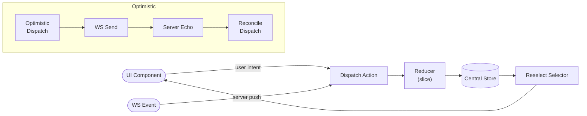
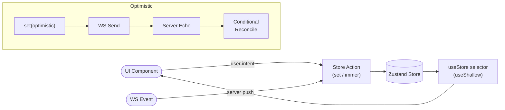
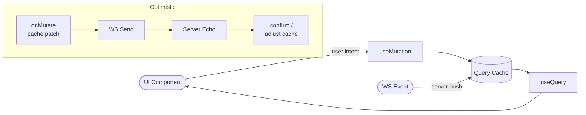

# State Implementation Plan

## Decision

Three implementations in order:

| # | Approach | Library/Tools | `?impl=` value | Status |
|---|----------|---------------|----------------|--------|
| 1 | Centralized flux | Redux Toolkit + Reselect | `redux` | Complete |
| 2 | Lightweight store | Zustand + Immer + useShallow | `zustand` | Complete |
| 3 | Server-state-first cache *(optional)* | TanStack Query | `tanstack` | Placeholder (complete) |

> **TanStack stop rule:** Only begin impl 3 if ≥2h remain after both Redux and Zustand are demo-ready and multi-tab tested.

Native React hooks (`BoardInstance.tsx`) remain as the existing local baseline — **not** a final compared implementation.

---

## Abstraction Layer (UI–State Contract)

The board UI **never imports from `redux`, `zustand`, or `@tanstack/react-query` directly**.  
It depends on one interface and one hook only. Three SOLID principles enforced by structure:

- **D — Dependency Inversion**: UI depends on the abstract `BoardContextValue` interface, not any concrete store
- **O — Open/Closed**: adding a new implementation is one line in a registry map; no existing UI or routing code ever changes
- **I — Interface Segregation**: the contract exposes exactly and only what the UI layer needs

### Step 1 — Define the contract: `src/board/BoardContext.ts` *(shared, never changes)*

```ts
interface BoardContextValue {
  // State
  cards: Card[]
  connectedUsers: string[]
  // Actions — void; all implementations are optimistic (fire-and-forget)
  addCard:    (columnId: ColumnId, values: CardFormValues) => void
  editCard:   (cardId: string, values: CardFormValues) => void
  deleteCard: (cardId: string) => void
  moveCard:   (cardId: string, toColumn: ColumnId) => void
}
```

Also export:
- `BoardContext` — `React.createContext<BoardContextValue>` with no default (throws if used outside a provider — intentional)
- `useBoardContext()` — the **only** hook the UI ever calls to access board state

### Step 2 — Each implementation exports a `BoardProvider` that satisfies the contract

Each implementation lives entirely within `src/implementations/<name>/`:
- `store.ts` / `slice.ts` — state logic; **completely internal**, never imported outside the folder
- `BoardProvider.tsx` — React component; wires internal store to `<BoardContext.Provider>`; owns the WS subscription lifecycle

Provider shape (identical signature across all implementations):

```tsx
export function BoardProvider({ children }: { children: React.ReactNode }) {
  // ... implementation-specific internals (store, WS subscription, optimistic logic) ...
  const value: BoardContextValue = { cards, connectedUsers, addCard, editCard, deleteCard, moveCard }
  return <BoardContext.Provider value={value}>{children}</BoardContext.Provider>
}
```

### Step 3 — `App.tsx` is the only file that knows implementations exist

A static registry maps `?impl=` values to lazy-loaded providers:

```ts
const IMPL_REGISTRY = {
  redux:    lazy(() => import('./implementations/redux/BoardProvider')),
  zustand:  lazy(() => import('./implementations/zustand/BoardProvider')),
  tanstack: lazy(() => import('./implementations/tanstack/BoardProvider')),
} as const

type ImplKey = keyof typeof IMPL_REGISTRY
const DEFAULT_IMPL: ImplKey = 'redux'
```

`App.tsx` reads `?impl=` from `useSearchParams()`, resolves the provider, and wraps the route tree. Adding a 4th implementation = one new line in this map. Nothing else changes.

### Step 4 — `BoardPage` and everything below it is permanently agnostic

`BoardPage` calls `useBoardContext()`, derives per-column card arrays, and passes them as props. No state-library import ever appears below this boundary.

### Layer diagram

```
App.tsx            reads ?impl= → selects BoardProvider from IMPL_REGISTRY
  └─ <BoardProvider>             ← implementation detail lives entirely here
       ├─ internal store / slice
       ├─ WS subscriptions
       └─ <BoardContext.Provider value={...}>
            └─ <BoardPage>       ← useBoardContext() only; never changes
                 ├─ <PresenceBar users={connectedUsers} />
                 └─ <KanbanBoard cards={cards} on*={...} />
                      └─ <Column> / <CardList> / <Card>   ← pure props, zero state imports
```

---

## Concept Diagrams

### Redux Toolkit



### Zustand



### TanStack Query *(optional third)*



---

## Build Phases

### Phase 1 — Shared contract *(prerequisite for all implementation work)*

- [x] Create `src/board/BoardContext.ts` — `BoardContextValue` interface, `BoardContext`, `useBoardContext()`
- [x] Create `src/board/BoardPage.tsx` — consumes `useBoardContext()`; derives per-column slices; renders shared UI; **no state library imports**
- [x] Update `App.tsx` — add `IMPL_REGISTRY` + query-param resolution; wrap route tree in resolved provider
- [x] Update `ComparePage.tsx` — renders two separate `BoardProvider` trees side by side using the same registry

### Phase 2 — Redux Toolkit *(depends on Phase 1)*

- [x] `src/implementations/redux/slice.ts` — `boardSlice` with actions: `setBoard`, `addCard`, `updateCard`, `moveCard`, `deleteCard`, `setPresence`; per-column Reselect selectors
- [x] `src/implementations/redux/store.ts` — configure store with boardSlice
- [x] `src/implementations/redux/BoardProvider.tsx` — wraps children in Redux `<Provider>`; subscribes to WS events via `useEffect` dispatch; maps store state → `BoardContextValue`

### Phase 3 — Zustand *(can run parallel with Phase 2 once Phase 1 is done)*

- [x] `src/implementations/zustand/store.ts` — `useBoardStore` with Immer middleware; same action surface as Redux slice
- [x] `src/implementations/zustand/BoardProvider.tsx` — calls store actions from WS event callbacks; `useShallow` selectors; maps → `BoardContextValue`

### Phase 4 — TanStack Query placeholder *(only if ≥2h remain after Phases 2–3 are demo-ready)*

- [x] `src/implementations/tanstack/BoardProvider.tsx` — minimal stub satisfying `BoardContextValue`; hardcoded `TODO` comment marking it as a placeholder

### Phase 5 — Validation and documentation

- [ ] Verify `?impl=redux`, `?impl=zustand`, `?impl=tanstack` all render the same UI without any UI code changes
- [ ] Multi-tab: create/edit/move/delete + presence propagate correctly for both core implementations
- [ ] Optimistic UX: local update is immediate; no flicker or duplicate on server echo
- [ ] Update README switching instructions, SKILL.md status table, HOURS.md

---

## Verification Checklist

- [ ] `?impl=redux` — board loads, all CRUD + move operations work, presence updates
- [ ] `?impl=zustand` — same as above
- [ ] `?impl=tanstack` — renders without crash (stub)
- [ ] Compare mode (`/compare`) — two different impls side by side, both reactive to same WS events
- [ ] Two browser tabs — changes in tab A appear in tab B for both implementations
- [ ] Optimistic UX — no duplicate cards, no flicker on server echo
- [ ] `bun run build` passes with no type errors

---

## Further Considerations

- If Redux setup overhead threatens the time budget, swap Redux for hooks as the second compared implementation and keep Zustand as the main contrast
- Capture design-journal notes immediately after each phase into `README.md` — do not leave for the end
- TanStack is included as a placeholder so the registry pattern can be demonstrated live even if the implementation is incomplete
